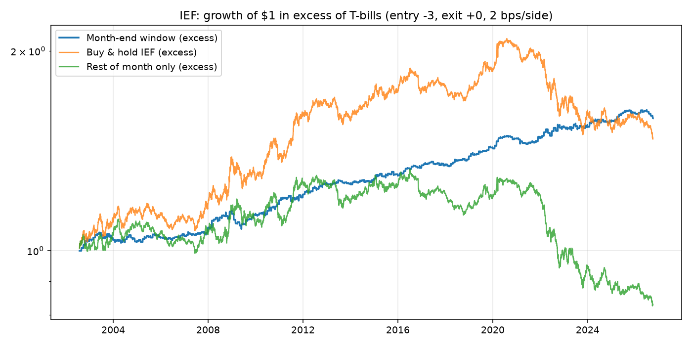
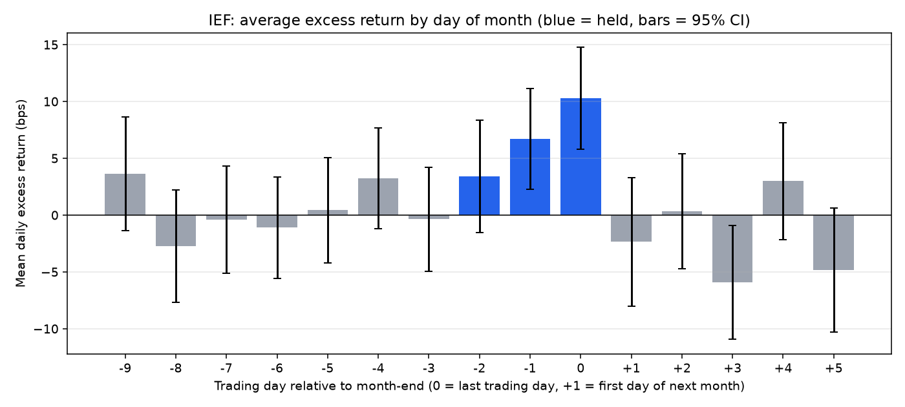
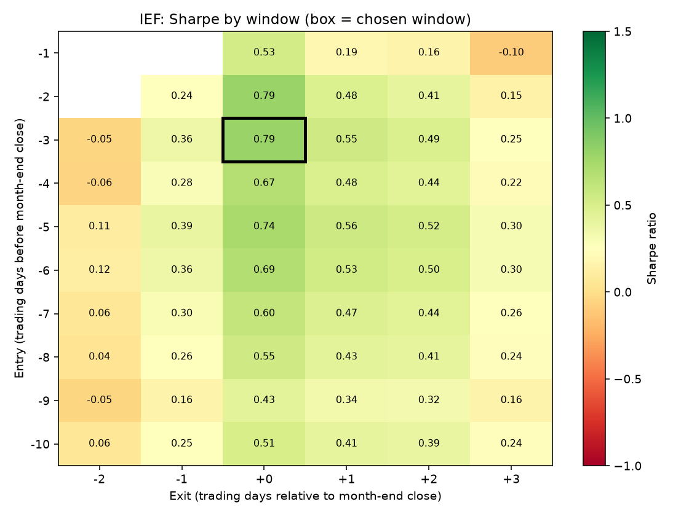
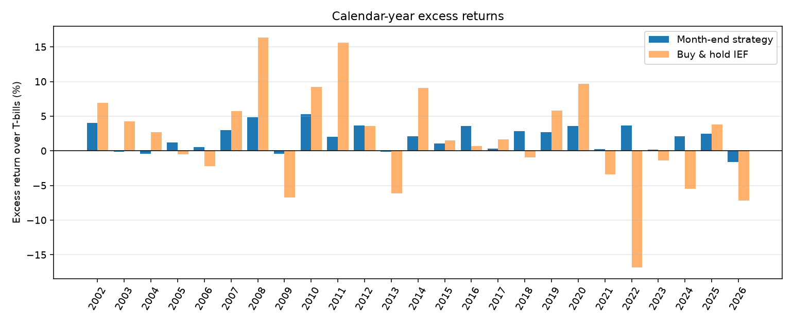

# Month-end Treasury rally: IEF

Data 2002-07-31 to 2026-10-02. Long from the close 3 trading days before month-end to the close +0 days relative to month-end; T-bills otherwise. Costs 2 bps per side.

## Summary

|                        | Month-end strategy   | Buy & hold   | Rest of month only   |
|:-----------------------|:---------------------|:-------------|:---------------------|
| CAGR                   | 3.68%                | 3.37%        | 0.93%                |
| Excess return (ann.)   | 1.93%                | 1.84%        | -0.58%               |
| Volatility (ann.)      | 2.44%                | 6.79%        | 6.34%                |
| Sharpe                 | 0.79                 | 0.27         | -0.09                |
| Max drawdown           | -6.10%               | -23.92%      | -27.65%              |
| Time in market         | 14.30%               | –            | –                    |
| Trades                 | 290                  | –            | –                    |
| Avg trade (net excess) | 0.16%                | –            | –                    |
| Hit rate               | 60.34%               | –            | –                    |
| t-stat (per trade)     | 4.14                 | –            | –                    |

## Is month-end special? (permutation test)

Average trade excess over T-bills, before costs: 0.201% vs 0.013% for a random same-length window each month; p-value 0.0005 (2000 simulations).

## Sub-periods

| Period                       | Start      | End        |   Strategy Sharpe |   Buy & hold Sharpe | Strategy excess (ann.)   | Avg trade (net)   | Hit rate   |   Trades |
|:-----------------------------|:-----------|:-----------|------------------:|--------------------:|:-------------------------|:------------------|:-----------|---------:|
| Full sample                  | 2002-07-31 | 2026-10-02 |              0.79 |                0.27 | 1.93%                    | 0.16%             | 60.34%     |      290 |
| 2002–2014                    | 2002-07-31 | 2014-12-31 |              0.79 |                0.65 | 2.06%                    | 0.17%             | 60.40%     |      149 |
| 2015–present                 | 2015-01-02 | 2026-10-02 |              0.79 |               -0.16 | 1.81%                    | 0.15%             | 60.28%     |      141 |
| In paper's sample (≤2018)    | 2002-07-31 | 2018-12-31 |              0.83 |                0.55 | 2.03%                    | 0.17%             | 61.42%     |      197 |
| After paper's sample (2019+) | 2019-01-02 | 2026-10-02 |              0.71 |               -0.28 | 1.74%                    | 0.14%             | 58.06%     |       93 |
| Last 3 years                 | 2023-10-02 | 2026-10-02 |              0.48 |               -0.2  | 0.99%                    | 0.08%             | 61.11%     |       36 |

## Charts

