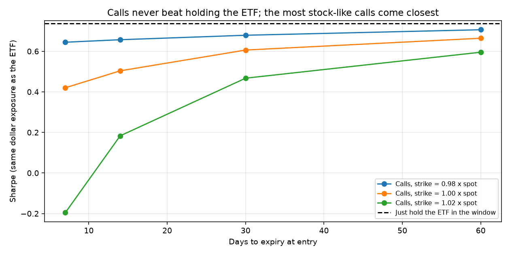

# Month-end call overlay (TLT)

Buy a 30-day call (strike 1.00 x spot) at the close 3 days before month-end, sell at the close +0 days relative to month-end. Synthetic American CRR prices at a flat implied vol; $0.01/share half-spread plus $0.65/contract each side.

|                                     | Avg per trade   | Std per trade   |   Sharpe (ann.) | Hit rate   | Worst trade   |   t-stat |   Trades |
|:------------------------------------|:----------------|:----------------|----------------:|:-----------|:--------------|---------:|---------:|
| ETF in window (excess)              | 0.28%           | 1.33%           |            0.74 | 60.98%     | -5.09%        |     3.61 |      287 |
| Call, % of premium (excess)         | 8.76%           | 46.80%          |            0.65 | 52.26%     | -69.24%       |     3.17 |      287 |
| Delta-matched call overlay (excess) | 0.25%           | 1.43%           |            0.61 | 52.26%     | -3.63%        |     2.96 |      287 |
| Delta-hedged call (% of spot)       | -0.01%          | 0.19%           |           -0.16 | 41.81%     | -0.51%        |    -0.8  |      287 |

Drift-tree model expected 10.25% per call trade after costs; realized 8.78%.

Implied-vol proxy (MOVE x duration 16) averaged 13.9% vs 13.3% realized over the next 21 days (correlation 0.46).

## Contract choice

|   Days to expiry |   Strike / spot | Avg call return   |   Call Sharpe |   Delta-matched Sharpe |   ETF Sharpe | Costs / premium   |
|-----------------:|----------------:|:------------------|--------------:|-----------------------:|-------------:|:------------------|
|                7 |            0.98 | 10.78%            |          0.7  |                   0.64 |         0.74 | 1.45%             |
|                7 |            1    | 14.60%            |          0.47 |                   0.42 |         0.74 | 4.70%             |
|                7 |            1.02 | -5.51%            |         -0.09 |                  -0.2  |         0.74 | 63.75%            |
|               14 |            0.98 | 9.40%             |          0.71 |                   0.66 |         0.74 | 1.37%             |
|               14 |            1    | 11.48%            |          0.54 |                   0.5  |         0.74 | 3.49%             |
|               14 |            1.02 | 6.64%             |          0.2  |                   0.18 |         0.74 | 16.48%            |
|               30 |            0.98 | 7.31%             |          0.73 |                   0.68 |         0.74 | 1.18%             |
|               30 |            1    | 8.76%             |          0.65 |                   0.61 |         0.74 | 2.28%             |
|               30 |            1.02 | 9.16%             |          0.49 |                   0.47 |         0.74 | 5.72%             |
|               60 |            0.98 | 5.91%             |          0.76 |                   0.71 |         0.74 | 1.00%             |
|               60 |            1    | 6.90%             |          0.71 |                   0.66 |         0.74 | 1.63%             |
|               60 |            1.02 | 7.73%             |          0.64 |                   0.6  |         0.74 | 3.02%             |

## Live scan

Spot 77.48 on 2026-10-03. Next window: enter 2026-10-27 close, exit 2026-10-30 close. Holding TLT itself scores 0.189 expected return per unit of risk.

| contract           |   strike |   bid |   ask |   market_iv |   elasticity |   expected_ret_net |   edge_per_risk |   cost_bps_of_spot_per_delta |
|:-------------------|---------:|------:|------:|------------:|-------------:|-------------------:|----------------:|-----------------------------:|
| TLT261130C00076000 |     76   |  2.91 |  2.94 |       0.164 |       21.574 |              0.055 |           0.136 |                        8.447 |
| TLT261106C00076500 |     76.5 |  2.18 |  2.21 |       0.166 |       36.379 |              0.105 |           0.133 |                        8.613 |
| TLT261106C00075500 |     75.5 |  2.87 |  2.91 |       0.17  |       28.521 |              0.079 |           0.133 |                        8.587 |
| TLT261120C00076000 |     76   |  2.76 |  2.79 |       0.168 |       24.473 |              0.063 |           0.132 |                        8.298 |
| TLT261130C00078000 |     78   |  1.77 |  1.79 |       0.158 |       28.373 |              0.069 |           0.131 |                        9.428 |
| TLT261130C00077000 |     77   |  2.3  |  2.33 |       0.161 |       24.733 |              0.059 |           0.128 |                        9.953 |
| TLT261106C00075000 |     75   |  3.25 |  3.3  |       0.172 |       25.356 |              0.066 |           0.127 |                        9.526 |
| TLT261120C00078000 |     78   |  1.61 |  1.63 |       0.162 |       33.629 |              0.083 |           0.126 |                        9.888 |
| TLT261120C00077000 |     77   |  2.14 |  2.17 |       0.165 |       28.708 |              0.069 |           0.123 |                       10.023 |
| TLT261120C00075000 |     75   |  3.45 |  3.5  |       0.171 |       20.83  |              0.049 |           0.119 |                       10.596 |
| TLT261106C00077000 |     77   |  1.86 |  1.9  |       0.163 |       41.337 |              0.105 |           0.115 |                       12.357 |
| TLT261106C00077500 |     77.5 |  1.58 |  1.61 |       0.162 |       46.844 |              0.122 |           0.114 |                       12.123 |
| TLT261120C00080000 |     80   |  0.84 |  0.85 |       0.158 |       44.457 |              0.092 |           0.1   |                       14.065 |
| TLT261106C00078000 |     78   |  1.32 |  1.35 |       0.16  |       52.952 |              0.122 |           0.097 |                       15.273 |
| TLT261130C00079000 |     79   |  1.32 |  1.35 |       0.155 |       32.319 |              0.058 |           0.095 |                       15.976 |
