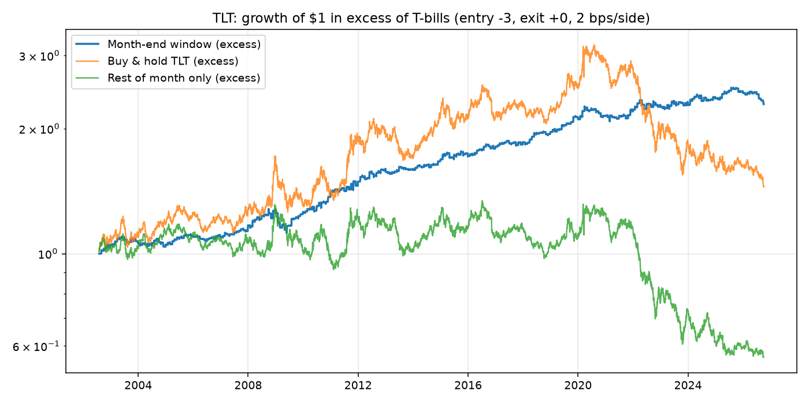
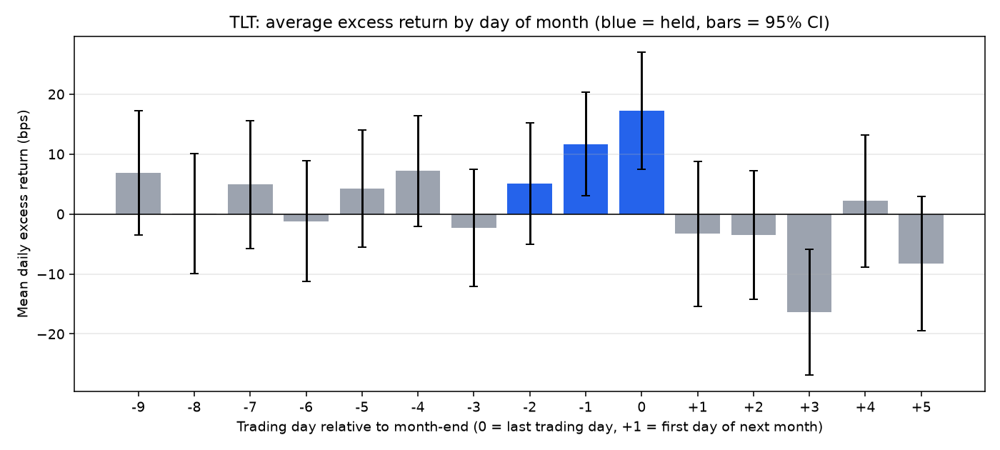
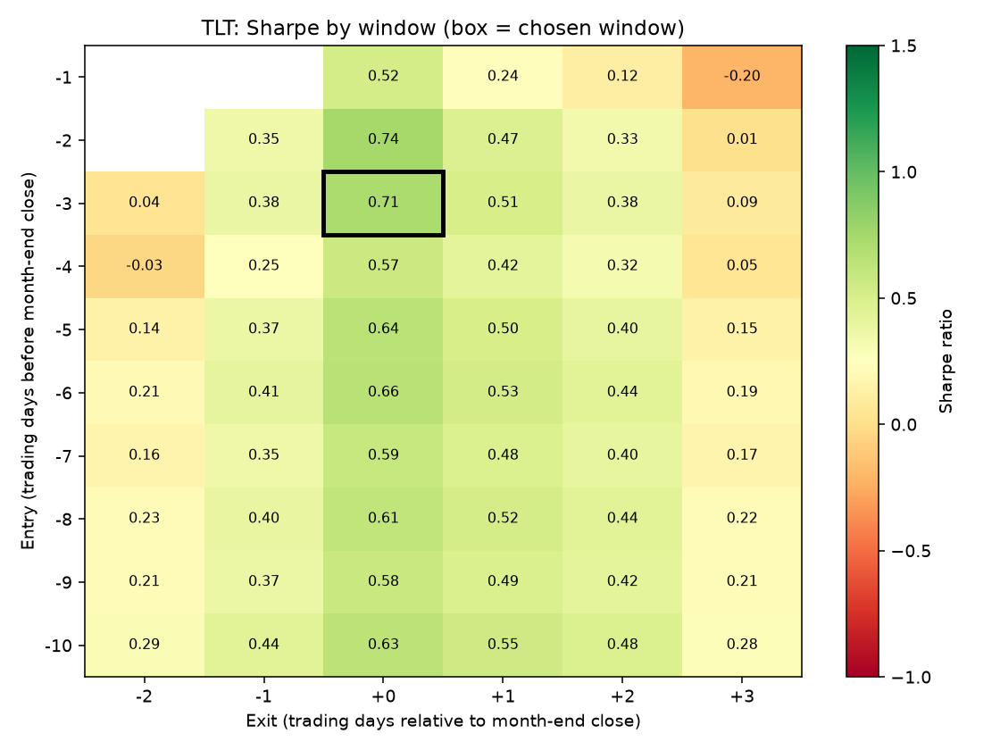
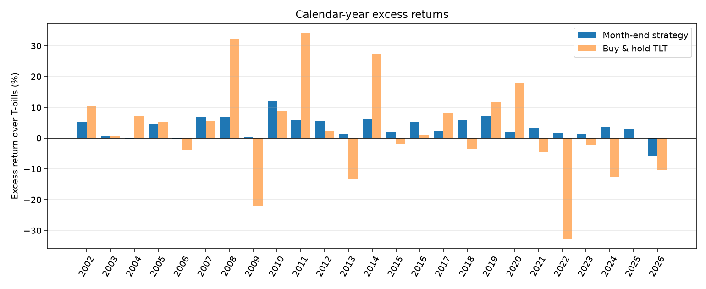

# Month-end Treasury rally: TLT

Data 2002-07-31 to 2026-10-02. Long from the close 3 trading days before month-end to the close +0 days relative to month-end; T-bills otherwise. Costs 2 bps per side.

## Summary

|                        | Month-end strategy   | Buy & hold   | Rest of month only   |
|:-----------------------|:---------------------|:-------------|:---------------------|
| CAGR                   | 5.28%                | 3.30%        | -0.67%               |
| Excess return (ann.)   | 3.56%                | 2.55%        | -1.49%               |
| Volatility (ann.)      | 5.01%                | 14.26%       | 13.35%               |
| Sharpe                 | 0.71                 | 0.18         | -0.11                |
| Max drawdown           | -12.42%              | -48.35%      | -51.14%              |
| Time in market         | 14.30%               | –            | –                    |
| Trades                 | 290                  | –            | –                    |
| Avg trade (net excess) | 0.30%                | –            | –                    |
| Hit rate               | 61.38%               | –            | –                    |
| t-stat (per trade)     | 3.79                 | –            | –                    |

## Is month-end special? (permutation test)

Average trade excess over T-bills, before costs: 0.335% vs 0.013% for a random same-length window each month; p-value 0.0005 (2000 simulations).

## Sub-periods

| Period                       | Start      | End        |   Strategy Sharpe |   Buy & hold Sharpe | Strategy excess (ann.)   | Avg trade (net)   | Hit rate   |   Trades |
|:-----------------------------|:-----------|:-----------|------------------:|--------------------:|:-------------------------|:------------------|:-----------|---------:|
| Full sample                  | 2002-07-31 | 2026-10-02 |              0.71 |                0.18 | 3.56%                    | 0.30%             | 61.38%     |      290 |
| 2002–2014                    | 2002-07-31 | 2014-12-31 |              0.85 |                0.52 | 4.35%                    | 0.36%             | 62.42%     |      149 |
| 2015–present                 | 2015-01-02 | 2026-10-02 |              0.55 |               -0.16 | 2.73%                    | 0.22%             | 60.28%     |      141 |
| In paper's sample (≤2018)    | 2002-07-31 | 2018-12-31 |              0.86 |                0.43 | 4.24%                    | 0.35%             | 63.96%     |      197 |
| After paper's sample (2019+) | 2019-01-02 | 2026-10-02 |              0.41 |               -0.27 | 2.12%                    | 0.17%             | 55.91%     |       93 |
| Last 3 years                 | 2023-10-02 | 2026-10-02 |             -0.04 |               -0.27 | -0.18%                   | -0.02%            | 61.11%     |       36 |

## Charts

